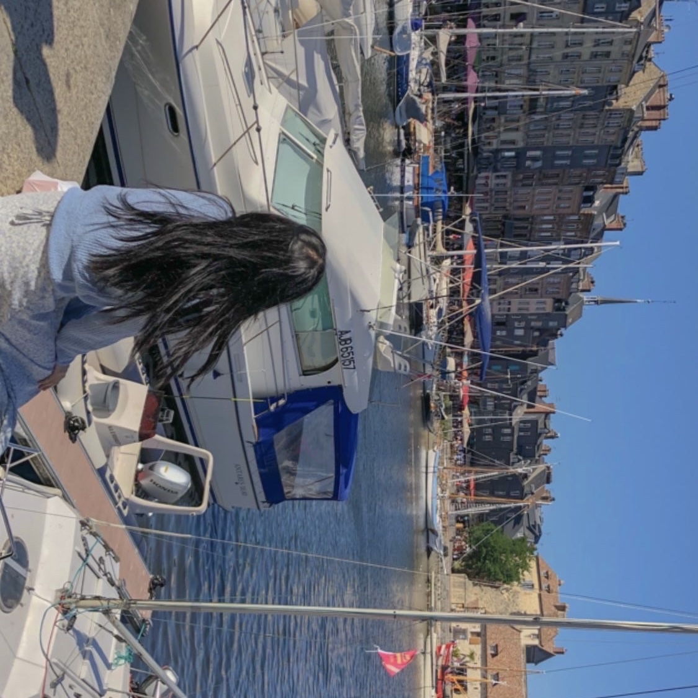
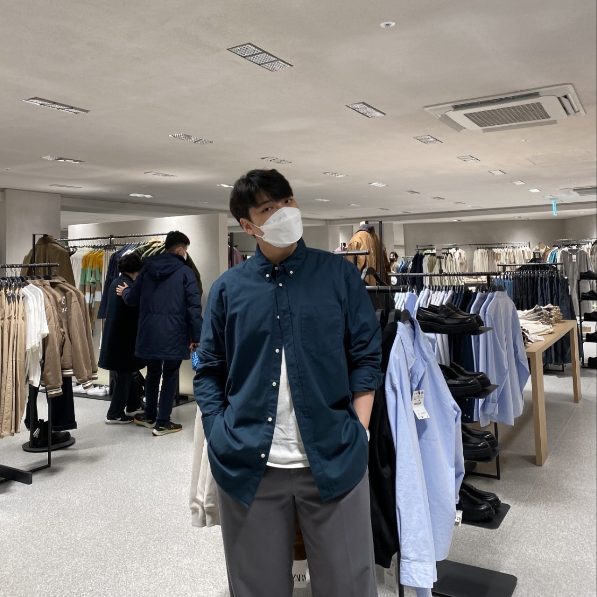
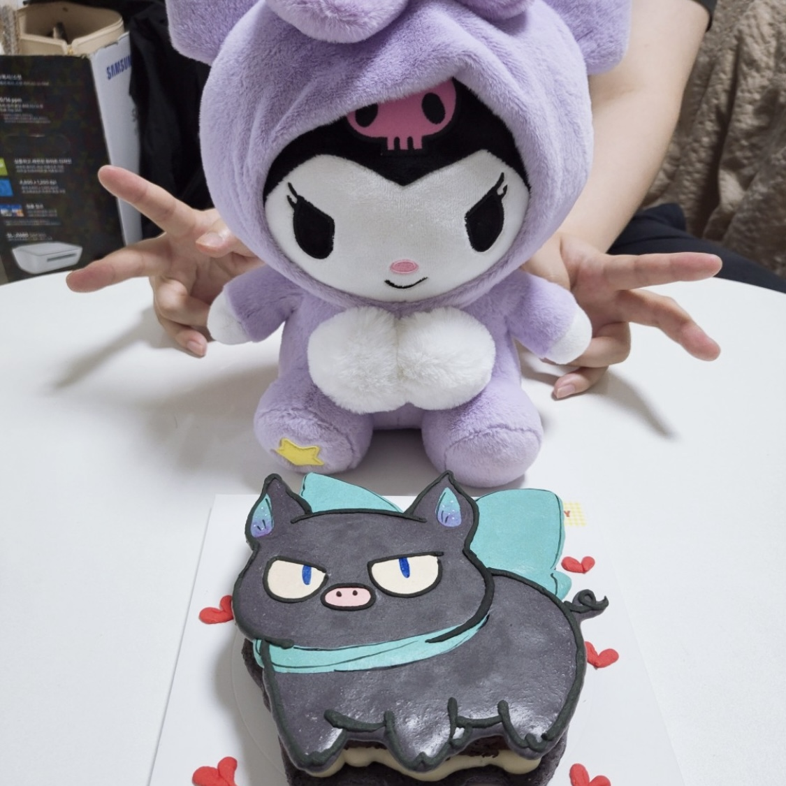

# 10조 알고가조

## 1. 프로젝트 간단 요약

- 오피스 이용자들을 위한 메신저 앱
- 올린 글에서 스레드를 생성, 개별 대화 가능
- 채널 무한정 생성 가능

## 2. 프로젝트 정보/개요 (진행 기간 / 목표 / 팀원)

- 진행 기간 : 2023.07.12 까지
- 목표 : slack 기능 구현 및 단점 보완
- 팀원 :

| 이진욱 | 소유나 | 박준규 | 신하연 | 김미정 |
|-------|--------|-------|-------|-------|
|  |  |  |  | 
&uarr; 사진을 클릭하시면 블로그로 이동합니다 :)

## 3. 프로젝트 설명 (구현한 기능 및 사진 등)

- 
- 무제한 메시징, 화면 공유가 가능한 오디오 및 비디오 대화, 비디오 클립 녹화, 외부 조직과의 협업, 다른 도구와의 통합(무제한), 시간이 걸리던 반복 업무의 자동화, 향상된 보안과 데이터 보호, 특정 규정 준수 지원
- 무료 / 유료(Slack Pro)로 구분

## 4. 사용한 기술 스택

- Java
- Javascript
- Spring
- Python
- C++